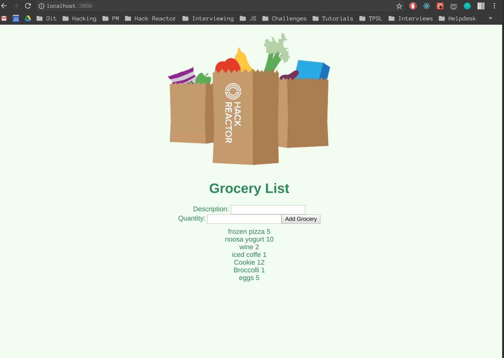

## HACK REACTOR REVIEW - GROCERY LIST

# The App
 

# Description
Grocery List displays a list of groceries and their quantity from the database upon initial load.
It allos users to add more groceries to the database and immediately displays new ones added.

# Instructions
1. Perform a Git Fork on the repository
2. Perform a Git Clone from your Github Repo to create a local clone of the project
3. Change Directory to the folder where you created the clone
4. Install nodemon by typing 'npm install -g nodemon'
5. Install all the projects dependencies by performing an npm install by typing 'npm install'
6. In the same terminal window, type 'npm run react-dev'. This will start webpack for transpilation of your jsx files
7. In a new terminal window, type 'npm run start'. This will start express web server for your site
8. Open a browser window and enter http://localhost:3000 as the URL and you should see the main page of the site
9. Open the code in your favorite editor and enjoy! :-0

# Important Information

##Express.js
For this project you will not be using live server but instead a local server has been setup for you
using Express. You don't need to worry about the details of the express server at this point. 

##Nodemon
You will also be using an npm package called nodemon which will watch files in your application directory
and restart your web server (Express.js). In order to run nodemon, follow step's #4 and #7 above in the instructions.

##Webpack
Instead of running a manual babel transpiler (with a watch command) you will instead use a package called Webpack.
Webpack has the ability to perform many functions but for this project it will simply transpile your jsx files
using the react and es2015 presets. You will perform the steps needed to run Webpack by performing
step #5 and step #6 above.

If you have errors in your react files and you don't see errors in your browser console window because there was
a problem transpiling the jsx files then you will see those errors in the terminal window where webpack is running.

##Summary 
Once you execute the steps in the instructions to start your Express.js server and Webpack you will not need to 
do anything further. Simply code and refresh your site in the browser window. The only other thing is viewing errors.
Please do NOT modify the file located at server/index.js

